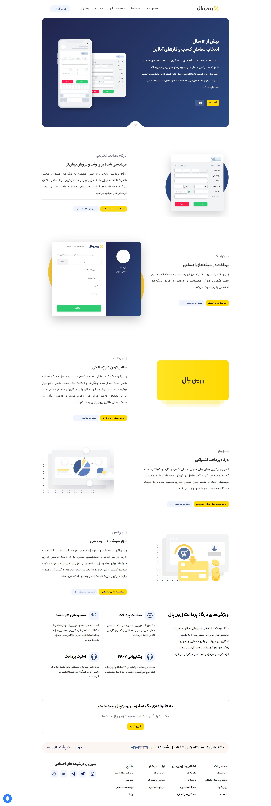

# ZarinPal Web Page 🚀

Welcome to the ZarinPal web page! Dive into the sleek and captivating design of this Iranian startup's website, meticulously crafted to offer an unparalleled user experience.

## About

[ZarinPal](https://shakiba-vakili.github.io/sample-Zarin-pal-web-page/) stands as a beacon of innovation in the Iranian startup scene, celebrated for its minimalist yet striking website design. While not the original developer, I embarked on this project as part of an HTML & CSS course in Iran, striving to capture the essence of ZarinPal's ethos. The result? A fully responsive webpage that mirrors the sophistication and simplicity ZarinPal is renowned for.

## Additional Resources 📚

- **LinkedIn:** Let's connect! Reach out to [Shakiba Sadat Vakili](https://www.linkedin.com/in/shakiba-vakili/) for potential collaborations or just a friendly chat.
- **Email:** Questions or interested in collaboration opportunities? Don't hesitate to drop a line at [shakibvakili@gmail.com](mailto:shakibvakili@gmail.com).
- **GitHub:** Explore more of my projects and contributions on GitHub: [@shakiba-vakili](https://github.com/shakiba-vakili).

Feel free to reach out for any inquiries or to discuss all things web development, design, and beyond! Let's embark on a journey of digital creativity together. 💡
